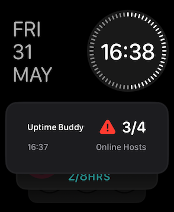
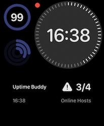
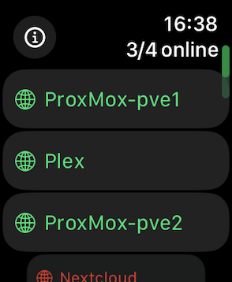
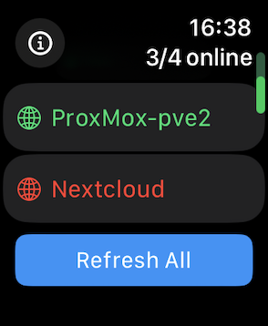
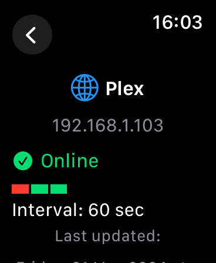
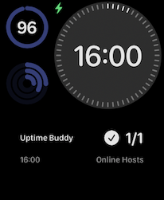

# Uptime Buddy

Uptime Buddy is in beta testing phase.
You can join the beta via TestFlight
[https://testflight.apple.com/join/okTxZGX1](https://testflight.apple.com/join/okTxZGX1)

Uptime Buddy is an uptime monitoring tool for your Apple Watch, designed to keep you informed about the status of your services. 
Uptime Buddy, requires a backend REST API.

<div style="display: flex; flex-wrap: wrap; gap: 20px;">
  
  
  
  
  
  
  
</div>


## Installation via Docker

Follow the steps below to set up the backend for Uptime Buddy.
## Docker Compose
Create a `docker-compose.yml` file with the following content to deploy the backend:

```yaml
services:
  uptime-buddy-api:
    image: schech1/uptime-buddy-api:latest
    ports:
      - "5005:5005"
    environment:
      - UPTIME_KUMA_URL=YOUR_UPTIME_KUMA_URL # e.g. http://192.168.1.34:3002/
      - USERNAME=YOUR_UPTIME_KUMA_USERNAME
      - PASSWORD=YOUR_UPTIME_KUMA_PASSWORD
```
The docker image supports `amd64` and `arm64` architecture.
Tested on Raspberry Pi 5 and Intel NUC 10.

Replace the environment variables with your actual Uptime Kuma URL, username, and password.

## Deploying the Backend
Save the docker-compose.yml file.

Run the following command in the directory containing the docker-compose.yml file:

```sh
docker-compose up -d
```

This command will pull the necessary Docker image and start the backend service on port 5005.

## Settings on the iOS App
After deploying the Docker container, open the Uptime Buddy companion app on your iPhone and configure the backend URL.
Use the address of the server where you deployed this container, including the port (e.g., http://your-server-ip:5005).

<br>


## Related Projects

This project is based on Uptime Kuma and uptime-kuma-api.

[Uptime Kuma](https://github.com/louislam/uptime-kuma): A self-hosted monitoring tool to monitor uptime for websites, applications and services.
[uptime-kuma.api](https://github.com/lucasheld/uptime-kuma-api): A Python API for Uptime Kuma.


## Contributing

Contributions are welcome.

## Support

If you encounter any issues or have questions, please open an issue on this GitHub repository.