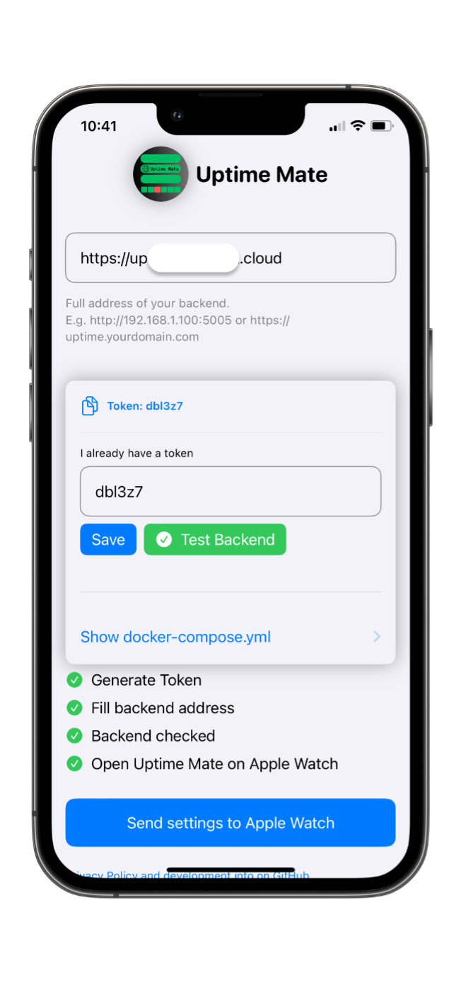
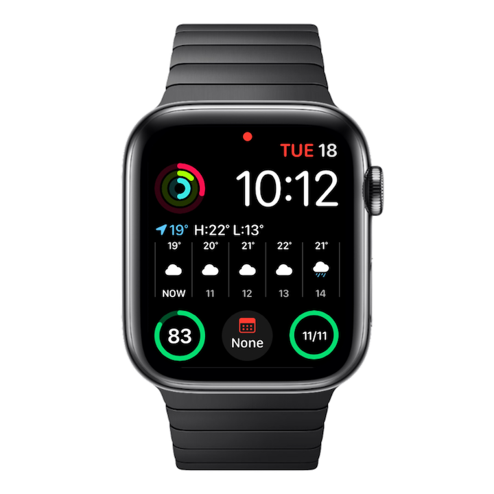
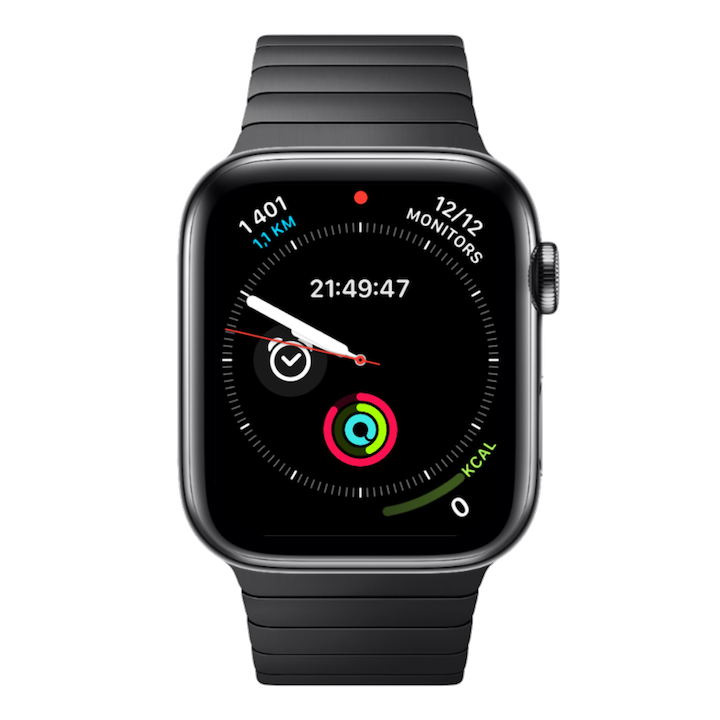
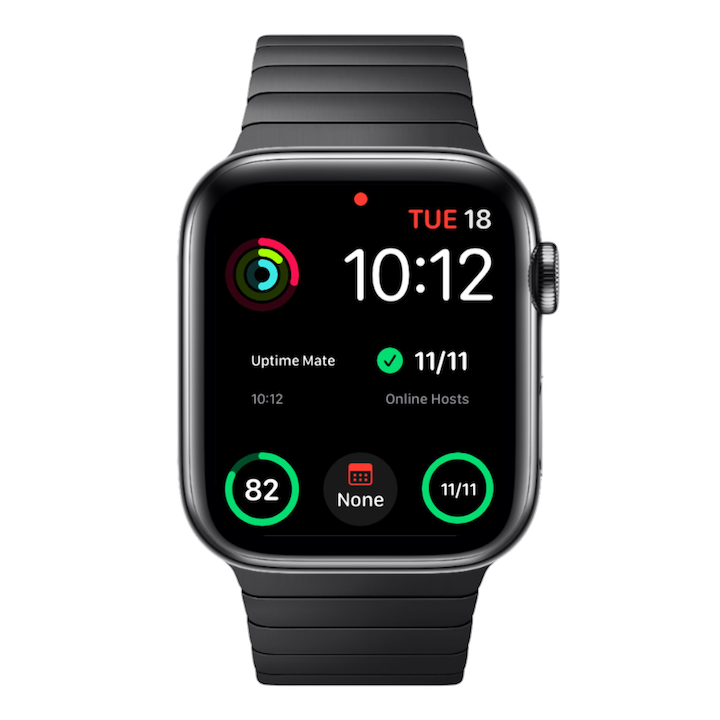

# Uptime Mate

**Uptime Buddy has been renamed to Uptime Mate.**


<p align="center">

<a href="https://hub.docker.com/r/schech1/uptime-buddy-api"></a>


<a target="_blank" href="https://github.com/schech1/uptime-buddy"></a>
</p>


<p align="center">
<a href="https://apps.apple.com/de/app/uptime-mate/id6503297780"></a>
</p>

Uptime Mate is an uptime monitoring tool for your Apple Watch, designed to keep you informed about the status of your services. 
Uptime Mate, requires a lightweight docker backend to run.


||||
|:---:|:---:|:---:|
||||


## Last Update Changelog


### Changes **App Version 1.1.4**


With version 1.1.4 of backend and app, the InfoView got reworked.

It will now show some system information about the backend host system.
It will also show and warn if backendversion and appversion are not in sync.


<table>
  <tr>
    <td style="text-align: center;">
      
      <p>Systeminfo</p>
    </td>
    <td style="text-align: center;">
      
      <p>Systeminfo Details</p>


  </tr>
</table>

## Backend Compatibility
**Be sure to pull the latest docker image**


The current version (1.1.4) in the App Store is compatible with `schech1/uptime-buddy-api:latest` 


## Prerequisites in the Uptime Mate iOS-App

For authentication, start the Uptime Mate iOS-App before you deploy the docker-container.
On first start, a token will be generated and displayed in the app.
Add the token to the docker-compose file or docker-run command.
Then deploy the container as described below.


## Settings on the iOS App
Before deploying the Docker container, open the Uptime Mate companion app on your iPhone.
Follow the these steps to configure Uptime Mate:

- Generate the token
- Enter your backend address (Address where you host this container, including the port (e.g.http://your-server-ip:5005))
- Test the backend
- Copy the generated token into your `docker-compose.yml` and deploy it.
- Send the setting to the Apple Watch. It will display your monitors from Uptime Kuma in the Apple Watch app
- Check out the Watch Face complications





## Installation via Docker


Uptime Mate requires a running instance of [Uptime Kuma](https://github.com/louislam/uptime-kuma)!

Be sure to set up Uptime Kuma correctly and provide the address, username and password of your Uptime Kuma instance to the docker compose file.

If you disabled auth in Uptime Kuma, remove the two lines from the compose-file entirely:

```yaml
- USERNAME=YOUR_UPTIME_KUMA_USERNAME
- PASSWORD=YOUR_UPTIME_KUMA_PASSWORD
```


Follow the steps below to set up the backend for Uptime Mate.


## Docker Compose
Create a `docker-compose.yml` file with the following content to deploy the backend:

```yaml
services:
  uptime-buddy-api:
    image: schech1/uptime-buddy-api:latest
    ports:
      - "5005:5005"
    environment:
      - UPTIME_KUMA_URL=YOUR_UPTIME_KUMA_URL # e.g. http://192.168.1.34:3002/
      - USERNAME=YOUR_UPTIME_KUMA_USERNAME # Optional: remove line if auth is disabled in Uptime Kuma
      - PASSWORD=YOUR_UPTIME_KUMA_PASSWORD # Optional: remove line if auth is disabled in Uptime Kuma
      - TOKEN=SECRET_TOKEN # Created by iOS-App
      - MFA=true  # Is MFA enabled in Uptime Kuma?
```
Docker image on [DockerHub](https://hub.docker.com/repository/docker/schech1/uptime-buddy-api/general)

The docker image supports `amd64` and `arm64` architecture.

Tested on Raspberry Pi 5 and Intel NUC 10.

Replace the environment variables with your actual Uptime Kuma URL, username, password and the generated token.


## Deploying the Backend
### Using docker-compose

Save the docker-compose.yml file.

Run the following command in the directory containing the docker-compose.yml file:

```sh
docker-compose up -d
```

This command will pull the necessary Docker image and start the backend service on port 5005.

### Using docker run (alternative)

*Hint: Remove `USERNAME` and `PASSWORD`, if auth is disabled in Uptime Kuma*

```bash
docker run -d --name uptime-buddy-api -p 5005:5005 -e UPTIME_KUMA_URL=YOUR_UPTIME_KUMA_URL -e USERNAME=YOUR_UPTIME_KUMA_USERNAME -e PASSWORD=YOUR_UPTIME_KUMA_PASSWORD -e TOKEN=YOUR_TOKEN schech1/uptime-buddy-api:latest

```


## The Apple Watch and iOS App

Uptime Mate consists of an iOS app and an Apple Watch app.
The iOS app is needed to set up the backend address and token.
When the iOS app is installed, the Apple Watch app can be installed via the Watch app of the iPhone.

Uptime Mate comes with Complication and SmartStack support.
The current update frequency of the Widgets is 15 minutes.
In future versions this will frequency will be individually adjustable, to extend battery life of the Apple Watch.

## Symbols on the Apple Watch

The following SF Symbols are used to illustrate the monitor type:


## Complications

Uptime Mate supports different complications on the WatchFace.

<table>
  <tr>
    <td style="text-align: center;">
      
      <p>Circular</p>
    </td>
    <td style="text-align: center;">
      
      <p>Corner</p>
    </td>
    <td style="text-align: center;">
      
      <p>Rectangular Big</p>
    </td>
  </tr>
</table>


<table>
  <tr>
<td style="text-align: center;">
      
      <p>Rectangular Small</p>
    <td style="text-align: center;">
      
      <p>Rectangular Dashed</p>
    </td>
    <td style="text-align: center;">
      
      <p>Circular Dashed</p>
    </td>
  </tr>
</table>


## Data Privacy

Uptime Mate does not save, share or forward any data. The data that is fetched from the backend is only displayed on your device.
The Apple Watch or iOS apps do not store any data locally on the devices, except the address of your backend. This is needed to keep
setting over reboots. 

## Bucket list

- [x] API token for backend authorization
- [x] UI improvements on iOS app
- [x] More Symbols for monitor types
- [x] Nice AppStore page
- [ ] Better looking complications
- [ ] Better user feedback when backend is down
- [ ] Communicate with Uptime Kuma directly (no additional docker container)


## Related Projects

This project is based on Uptime Kuma and uptime-kuma-api.

[Uptime Kuma](https://github.com/louislam/uptime-kuma): A self-hosted monitoring tool to monitor uptime for websites, applications and services.

[uptime-kuma-api](https://github.com/lucasheld/uptime-kuma-api): A Python API for Uptime Kuma.


## Contributing

Contributions are welcome.

## Support Me

If you enjoy using this app, please consider leaving a 
[Rating on the App Store!](https://apps.apple.com/app/id6503297780?action=write-review)

If you encounter any issues or have questions, please open an issue on this GitHub repository.
